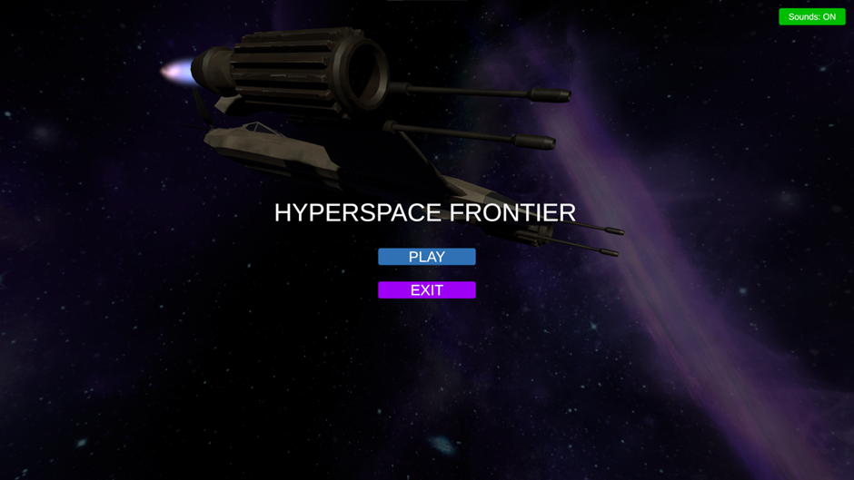
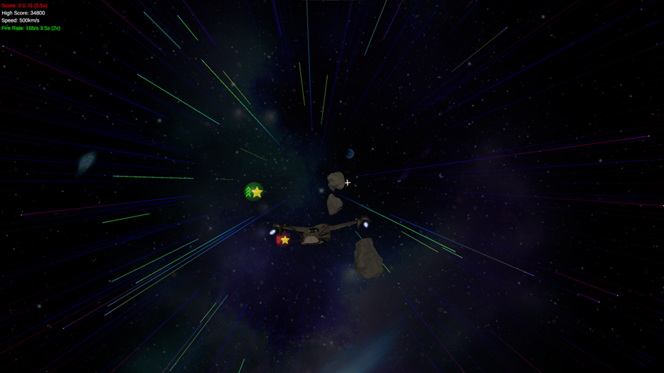

### Screenshots
#### Menu

#### Gameplay

### Description: 
A simple, "endless runner" type of game in which a spaceship "jumps into hyperspace" and must achieve as many points as possible through destroying asteroids, collecting power-ups and avoiding debuffs

### Module: 
Games Programming

### Year: 
3rd Year GY350