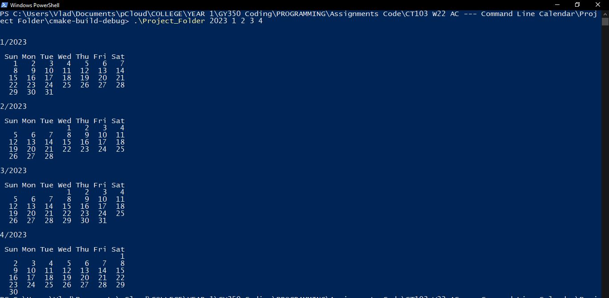

### Screenshots

### Description: 
Dynamically loading calendar using command-line arguments as inputs. Accurately displays a given month of a specific year > 1900 in the console, taking into account leap years. 

### Module: 
Programming

### Year: 
1st Year GY350