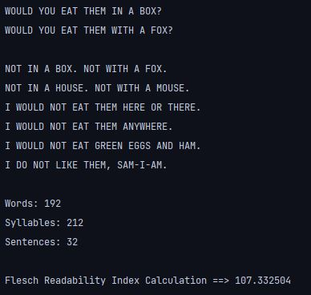

### Screenshots

### Description: 
Calculates the Flesch readability index on two different articles. Parses the text from the articles to extract the number of words, sentences and syllables to be used in the calculation.

### Module: 
Programming

### Year: 
1st Year GY350