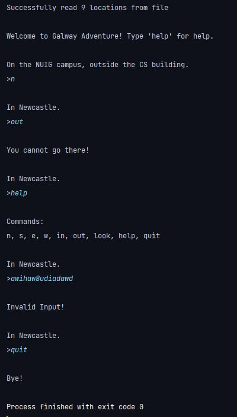

### Screenshots:

### Description: 
Simple game in which the user explores different parts of Galway and the university campus by typing directions (N, S, W, E) in the console. The output of each command depends on the user's current location. Location data is read in from a file and parsed. 

### Module: 
Programming

### Year: 
1st Year GY350