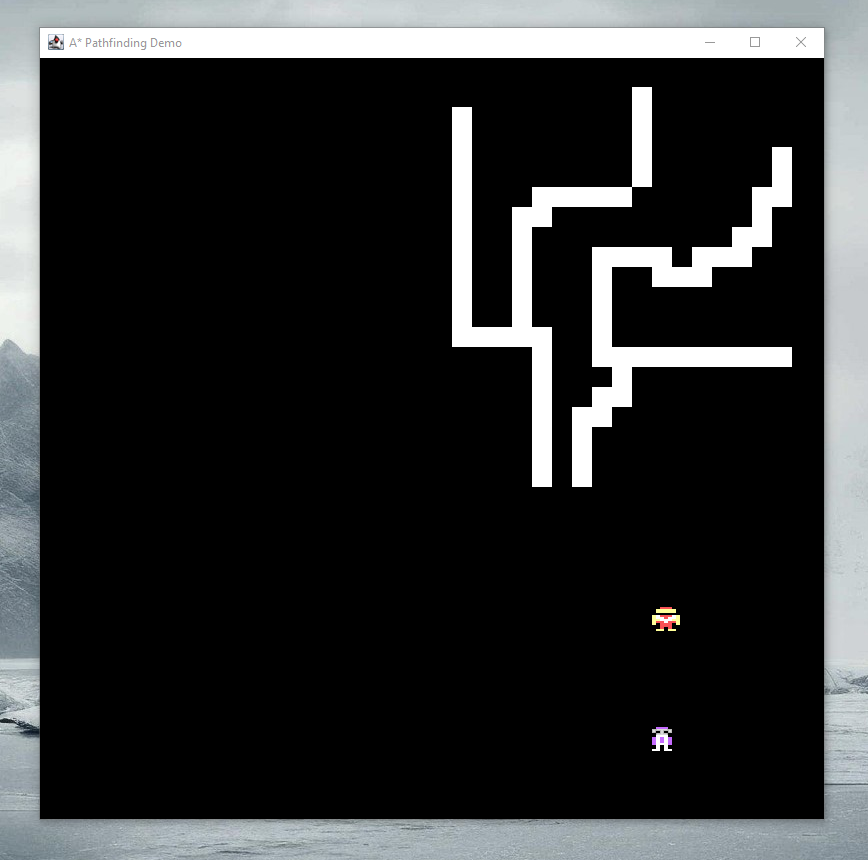

### Screenshots:

### Description: 
Simple JFrame game in which an enemy moves towards a player on a pixel map using the A-Star Pathfinding algorithm. The player can draw walls on the pixel map using their cursor. The enemy will adapt his path to new obstacles with each frame update if it is still possible to reach the player.

### Module: 
Games Development

### Year: 
2nd Year GY350