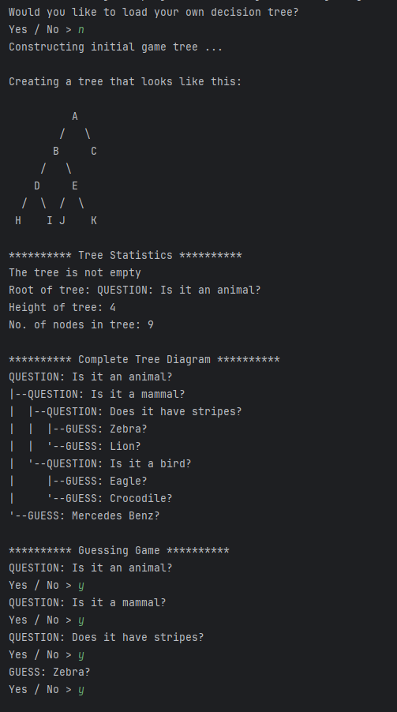
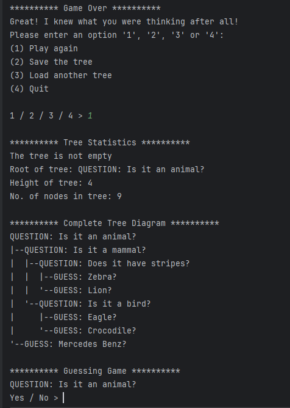
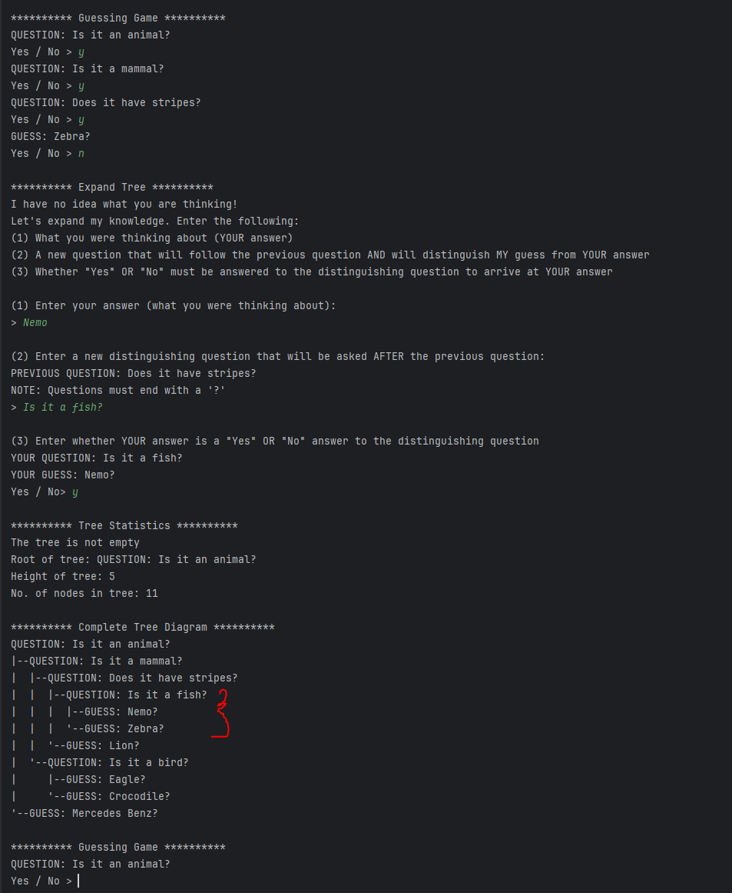
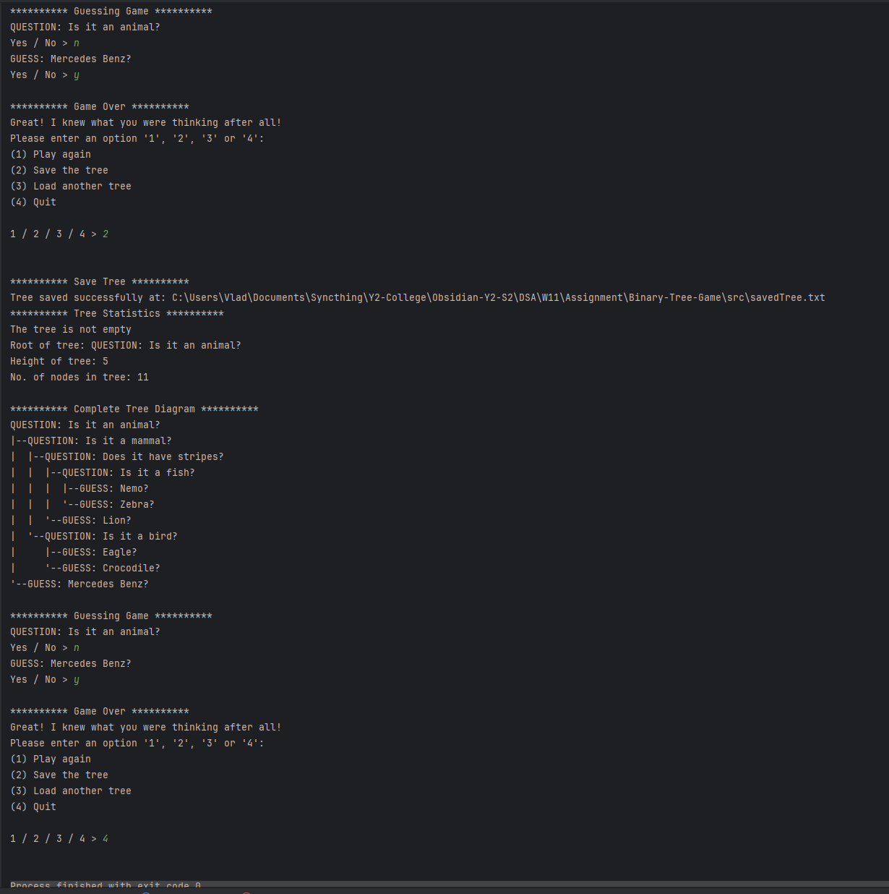

### Screenshots:

### Description: 
Guessing game which utilises a binary tree data structure. Guessing trees can be built and expanded over time by the player. Features saving/loading functionality through the use of object serialisation.

### Module: 
Data Structures & Algorithms

### Year: 
2nd Year GY350