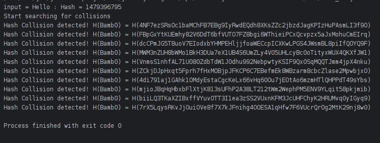

### Screenshots:

### Description: 
Program which demonstrates weak collision resistance through a brute-force technique on two different hashing algorithms.

### Module: 
Cybersecurity

### Year: 
2nd Year GY350