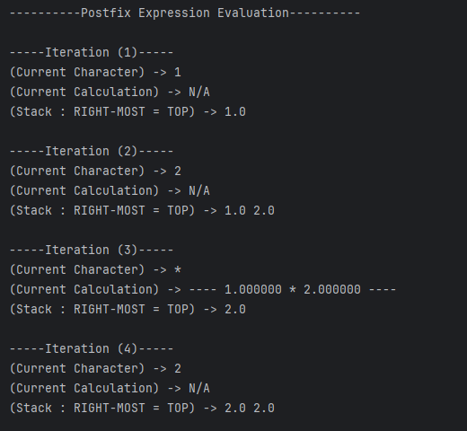
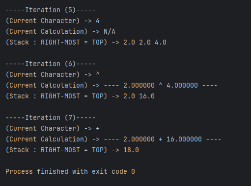
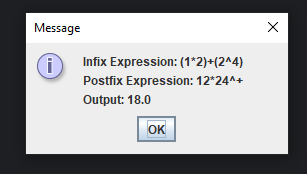

### Screenshots:
#### (1) Evaluation

#### (2) Output

### Description: 
Stack-based algorithm which validates an expression to ensure it is in infix notation, then converts it to postfix notation and evaluates the generated postfix expression.

### Module: 
Data Structures & Algorithms

### Year: 
2nd Year GY350