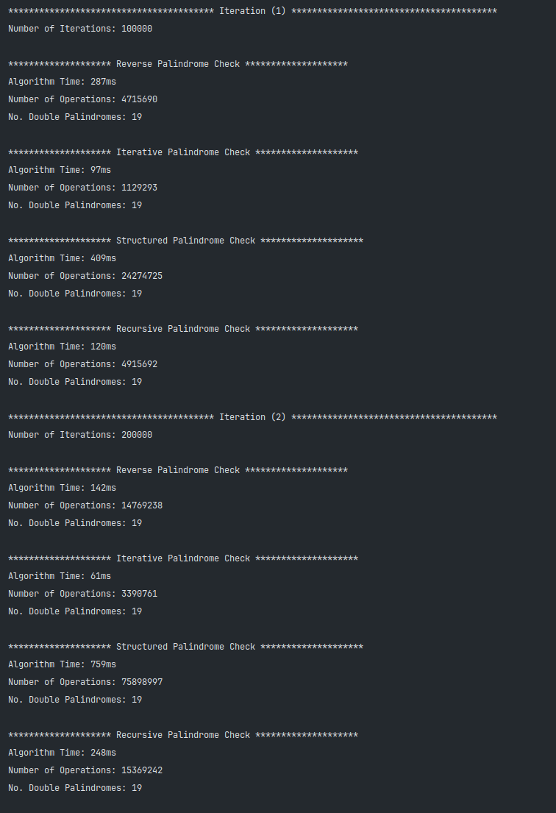
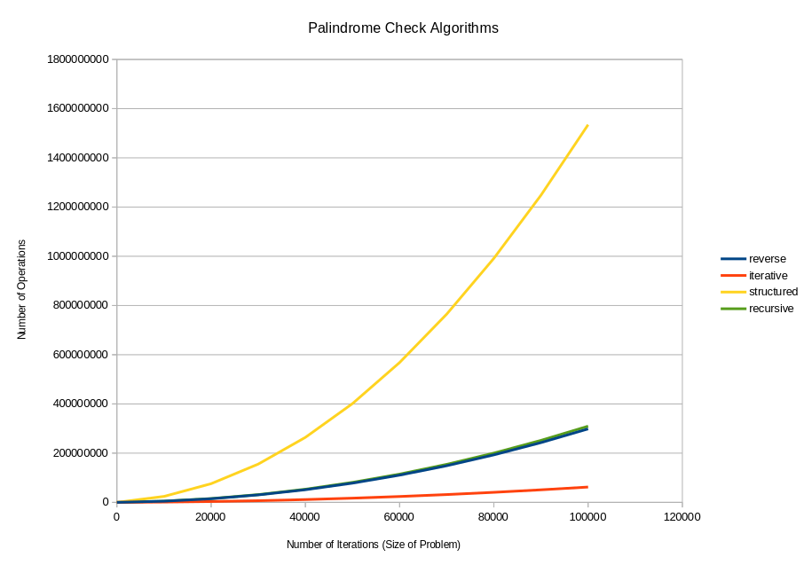

### Screenshots:
#### (1) Sample Iteration

#### (2) Results Graph

### Description: 
Program which compares four different implementations of palindrome-checking functions. Used to demonstrate the time complexity of different algorithms.

### Module: 
Data Structures & Algorithms

### Year: 
2nd Year GY350