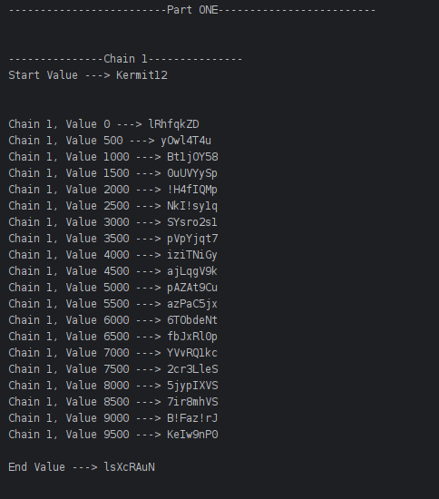
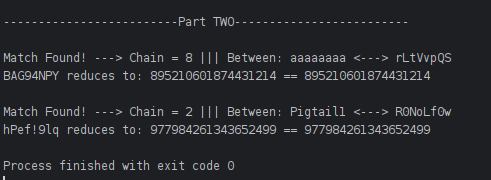

### Screenshots:
#### (1) Table Generation

#### (2) Searching for Matches

### Description: 
Simple program which creates a Rainbow Table using 10 hard-coded start values.

### Module: 
Cybersecurity

### Year: 
2nd Year GY350