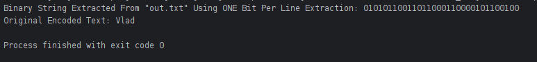
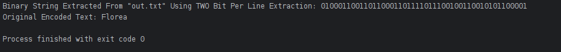

### Screenshots:
#### (1) First Name Decoded

#### (2) Last Name Decoded

### Description: 
Simple program which encodes/decodes a binary string into/from a file using steganographic methods. 

### Module: 
Cybersecurity

### Year: 
2nd Year GY350