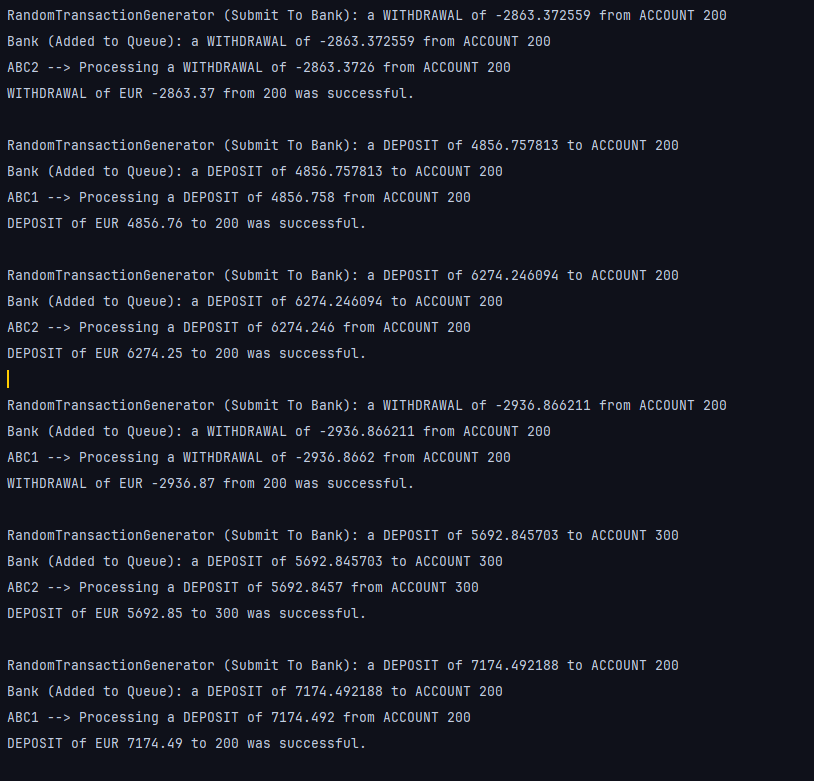
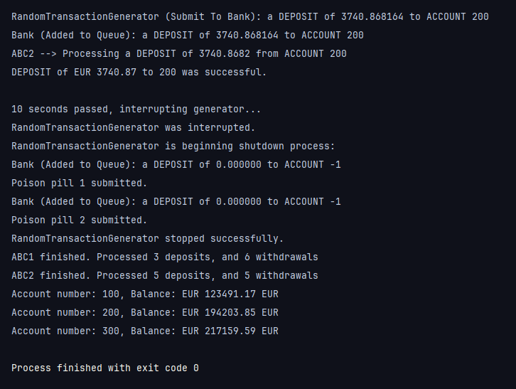

### Screenshots:

### Description: 
Application which showcases the handling of bank account objects within a shared instance using appropriate concurrency control measures

### Module: 
Programming

### Year: 
3rd Year GY350