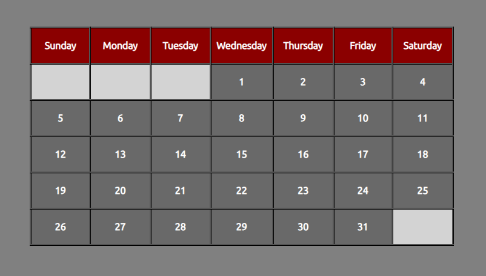

### Screenshots:

### Description: 
Dynamically loading calendar. Accurately loads a given month of a specific year > 1900, taking into account leap years. 

### Module: 
Web Development

### Year: 
1st Year GY350