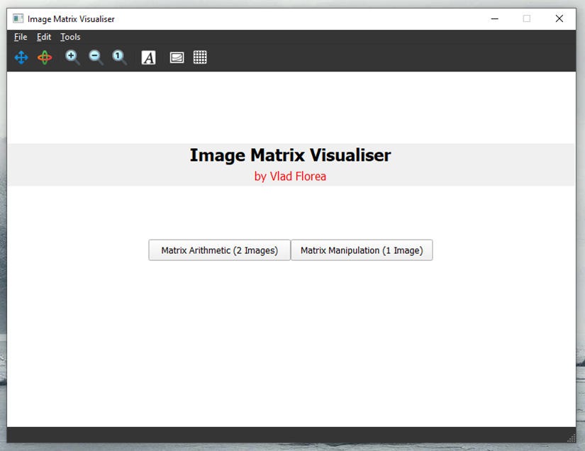
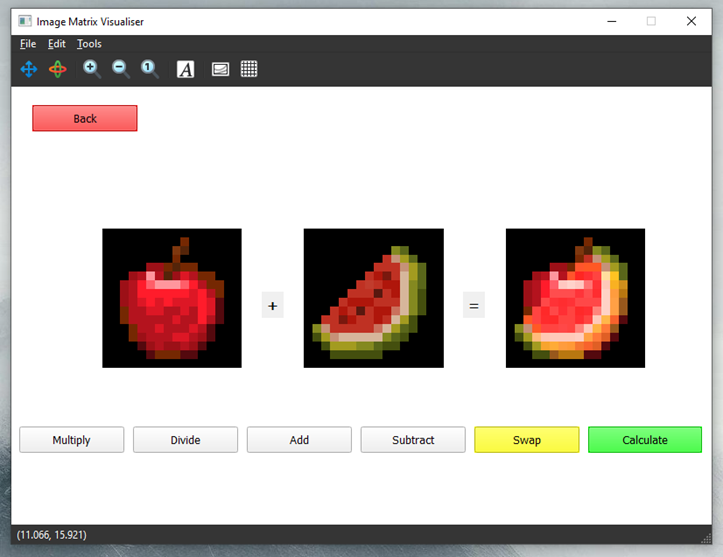
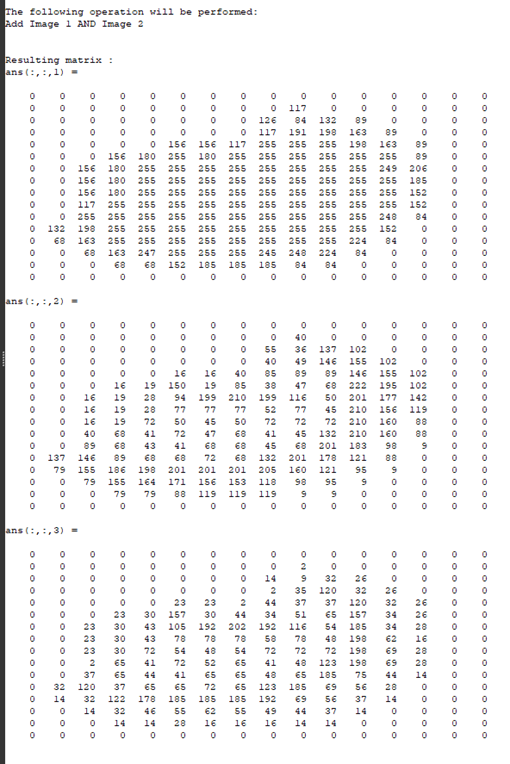
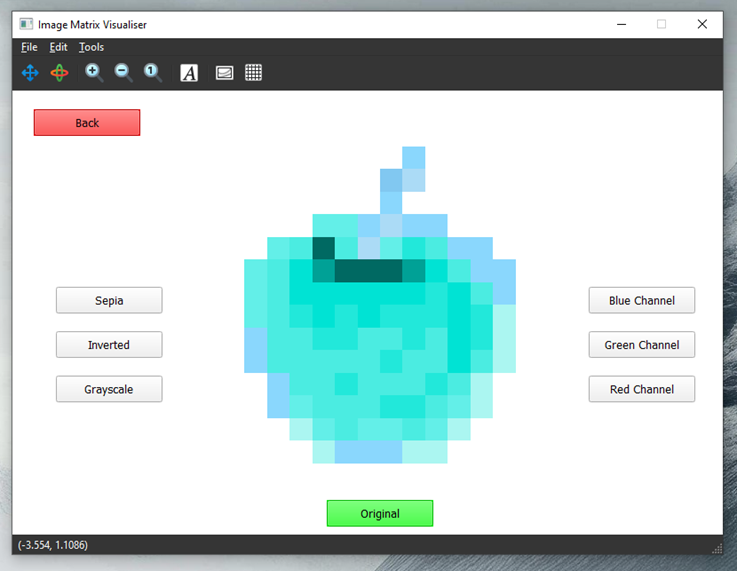
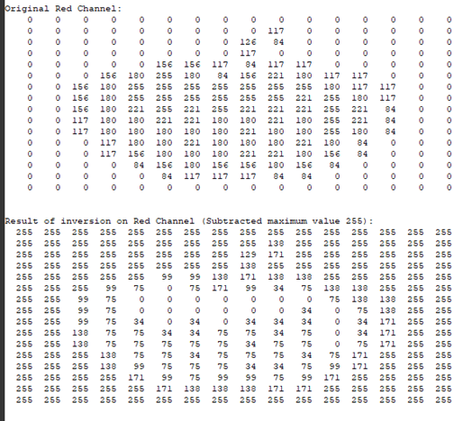

### Screenshots:
#### (1) Menu

#### (2) Image Matrix Arithmetic

#### (3) Image Matrix Manipulation

### Description: 
Image manipulation tool using GNU Octave language. Supports matrix arithmetic operations and applying filters to images given as input by the user. Image matrix operations are visualised in the console.    

### Module: 
Linear Algebra

### Year: 
2nd Year GY350